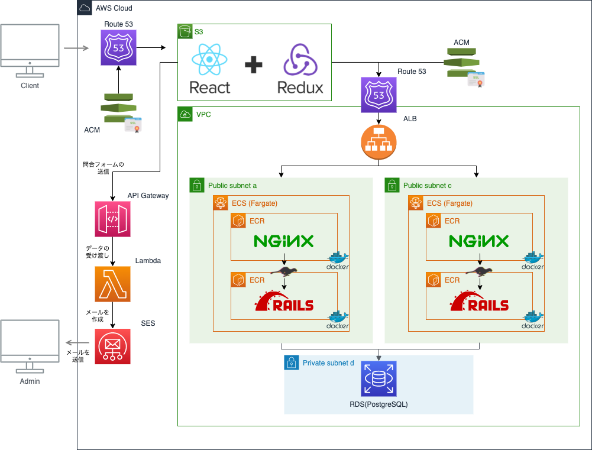

# このソースコードにについて
    このソースコードは家計簿アプリ「SUM APP」のフロントエンド部分になります。 
    また「SUM APP」は貯金目標の達成を補助してくれる家計簿アプリです。アプリケーションのURL、アプリケーション概要につきましては
    以下をご参照ください。 

    - [アプリケーションURL](https://www.kakeibo-app.com/)
    - [アプリケーション概要](https://www.kakeibo-app.com/tech_info)

## インフラ構成について
    インフラ構成につきましては、以下の図の通りAWSを中心に構築しています。 

    

## 実装機能について
    実装されているきのうに関しては

## 使用している主なライブラリについて